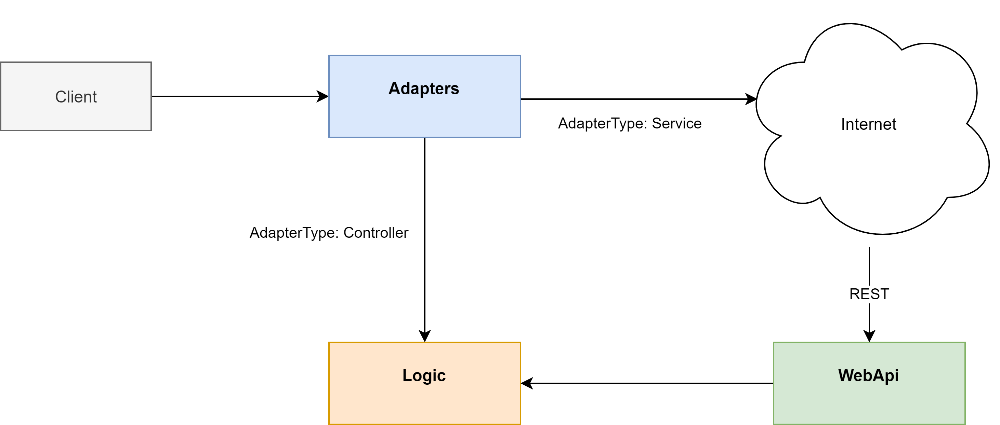
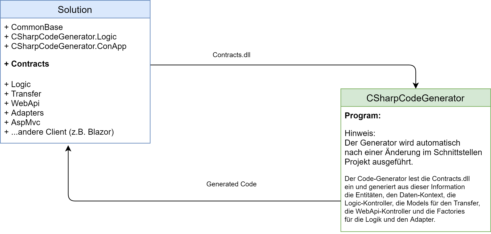
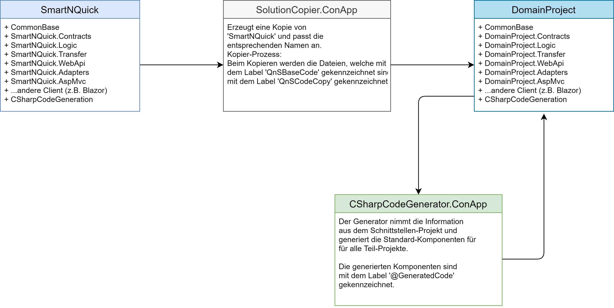
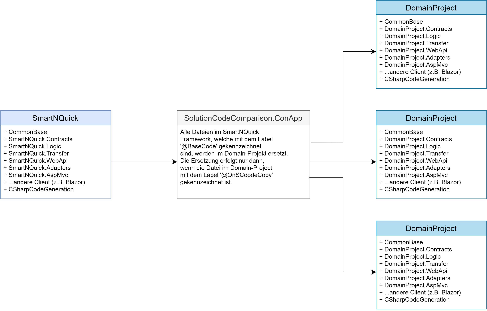

# SnQMusicStore

Das Projekt 'SnQMusicStore' ist ein kleiner Framework f�r die Erstellung von datenzentrierten Anwendungen. Ausgehend von diesem System k�nnen neue Anwendungen erstellt und erweitert werden. Der Framework unterst�tzt die Entwicklung einfacher Service-Anwendungen (auch *MicroApps* genannt) als auch die Erstellung von gro�en skalierbaren System-Anwendungen. Bei der Herstellung dieser Systeme wird der Entwickler von einem Code-Generator unterst�tzt. Details zur Arbeitsweise des Generators folgen Sie in den Kapiteln weiter hinten.

## Infrastruktur

Zur Umsetzung des Projektes wird DotNetCore (5.0 und h�her) als Framework, die Programmiersprache CSharp (C#) und die Entwicklungsumgebung Visual Studio 2019 Community verwendet. Alle Komponenten k�nnen kostenlos aus dem Internet heruntergeladen werden.

In diese Dokumentation werden unterschiedlichste Begriffe verwendet. In der nachfolgenden Tabelle werden die wichtigsten Begriffe zusammengefasst und erl�utert:

|Begriff|Bedeutung|Synonym(e)
|---|---|---
|**Solution**|Ist der Zusammenschluss von verschiedenen Teilprojekten zu einer Gesamtl�sung.|Gesamtl�sung, L�sung, Projekt
|**Domain Solution**|Hier ist eine Gesamtl�sung gemeint, welches f�r einen bestimmten Problembereich eine L�sung darstellt.|Probleml�sung, Projekt
|**Teilprojekt**|Ist die Zusammenstellung von Klassen und/oder Algorithmen, welches eine logische Einheit f�r die L�sungen bestimmter Teilprobleme bildet.|Teill�sung, Projekteinheit, Projekt
|**Projekttyp**|Unter Projekttyp wird die physikalische Beschaffenheit eines Projektes bezeichnet. Es gibt zwei grundlegende Typen von Projekten. Zum einen gibt es einen wiederverwendbaren und zum anderen einen ausf�hrbaren Projekttyp. <br>**Als Regel gilt:**<br> Alle Programmteile werden in wiederverwendbare Projekte implementiert. Die ausf�hrbaren Einheiten dienen nur als Startprojekte und leiten die Anfragen an die wiederverwendbaren Projekt-Komponenten weiter.|Bibliothekstyp, Consolentyp
|**Libray**|Kennzeichnet einen wiederverwendbaren Projekttyp.|Bibliothek
|**Console**|Kennzeichnet einen ausf�hrbaren Projekttyp. Dieser Typ startet eine Konsole f�r die Ausf�hrung.|Konsole
|**Host**|Dieser Typ kennzeichnet ein ausf�hrbares Projekt, welches zum Starten den IIS verwendet oder im Modus 'selfhosting' gestartet werden kann.|Web-Application 
|**Abh�ngigkeit**|Die Abh�ngikeit beschreibt die Beziehungen von Projekten untereinander. Ben�tigt ein Projekt Funktionalit�ten aus einem andern Projekt, so wird eine Projektreferenz zum anderen Projekt ben�tigt.|Projektreferenz, Referenz, Dependency, Projektverweis

## Framework
Die Struktur des Frameworks besteht aus unterschiedlichen Teilprojekten und sind in einer Gesamtl�sung (im Kontext von Visual Studio ist das eine Solution) zusammengefasst. Eine Erl�uterung der einzelnen Projekte, deren Typ und die Abh�ngigkeit finden sie in der folgenden Tabelle:

|Projekt|Beschreibung|Typ|Abh�ngigkeit
|---|---|---|---|
|**CommonBase**|In diesem Projekt werden alle Hilfsfunktionen und allgemeine Erweiterungen zusammengefasst. Diese sind unabh�ngig vom Problembereich und k�nnen auch in andere Dom�n-Projekte wiederverwendet werden.|Library|keine
|**SnQMusicStore.Contracts**|In diesem Projekt werden alle f�r das System notwendigen Schnittstellen und Enumerationen implementiert.|Library|CommonBase
|**SnQMusicStore.Logic**|Dieses Projekt beinhaltet den vollst�ndigen Datenzugriff, die gesamte Gesch�ftslogik und stellt somit den zentralen Baustein des Systems dar.|Library|CommonBase, SnQMusicStore.Contracts
|**SnQMusicStore.Transfer**|In diesem Projekt werden alle Transferobjekte f�r den Datenaustausch, zwischen den einzelnen Schichten, verwaltet.|Library|CommonBase, SnQMusicStore.Contracts
|**SnQMusicStore.WebApi**|In diesem Projekt ist die REST-Schnittstelle implementiert. Diese Modul stellt eine API (Aplication Programming Interface) f�r den Zugriff auf das System �ber das Netzwerk zur Verf�gung.|Host|CommonBase, SnQMusicStore.Transfer, SnQMusicStore.Logic
|**SnQMusicStore.Adapters**|In diesem Projekt ist der Zugriff auf die Logik abstrahiert. Das bedeutet, dass der Zugriff auf die Gesch�ftslogik direkt oder �ber die REST-Schnittstelle erfolgen kann. F�r dieses Modul ist die Schnittstelle 'IAdapterAccess\<T\>' im Schnittstellen-Projekt implementiert. N�here Details dazu finden sich im Kapitel 'Kommunikation der Layer'.|Library|CommonBase, SnQMusicStore.Contracts, SnQMusicStore.Logic, SnQMusicStore.Transfer
|**SnQMusicStore.ConApp**|Dieses Projekt dient als Initial-Anwendung zum Erstellen der Datenbank, das Anlegen von Anmeldedaten falls die Authentifizierung aktiv ist und zum Importieren von bestehenden Daten. Nach der Initialisierung wird diese Anwendung kaum verwendet.|Console|SnQMusicStore.Adapters, SnQMusicStore.Contracts , SnQMusicStore.Logic
|**SnQMusicStore.AspMvc**|Diese Projekt beinhaltet die Basisfunktionen f�r eine AspWeb-Anwendung und kann als Vorlage f�r die Entwicklung einer einer AspWeb-Anwendung mit dem SnQMusicStore Framework verwendet werden.|Host|CommonBase, SnQMusicStore.Contracts, SnQMusicStore.Adapter
|**SnQMusicStore.XxxYyy**|Es folgen noch weitere Vorlagen von Client-Anwendungen wie Angular, Blazor und mobile Apps. Zum jetzigen Zeitpunkt existiert nur die AspMvc-Anwendung. Die Erstellung und Beschreibung der anderen Client-Anwendungen erfolgt zu einem sp�teren Zeitpunk.|Host|CommonBase, SnQMusicStore.Contracts, SnQMusicStore.Adapter.

### Kommunikation der Layer

Die Client-Anwendung interagiert mit dem Backend-System �ber den Adapters-Layer. Vor dem Zugriff kann der Client den Adapter so konfigurieren, dass der Zugriffpfad auf die Logik direkt oder indirekt �ber einen REST-Service erfolgt. Der Vorteil eines direkten Zugriffs liegt in der geringeren Datentransformation zwischen der Logik und dem Client. Nachteilig ist allerdings, dass der Client und das Backend-System am gleichen Ger�t ausgef�hrt werden m�ssen und die Skalierbarkeit verloren geht. Die nachfolgende Abbildung zeigt den Kommunikations-Pfad zwischen den einzelnen Ebenen.  



Die Konfiguration des Zugriffs auf das Backend-System kann �ber die Factory-Klasse des Layers Adapters gesteuert werden:

```csharp
// Access via the service (indirect).
Adapters.Factory.BaseUri = "https://localhost:5001/api";
Adapters.Factory.Adapter = Adapters.AdapterType.Service;
```

Oder

```csharp
// Access via the controller (direct).
Adapters.Factory.Adapter = Adapters.AdapterType.Controller;
```

Der Zugriff �ber den Service erfordert nat�rlich die Angabe der Adresse vom REST-Service. Hingegen ist die Angabe der Web-Adresse f�r den direkten Zugriff nicht von Bedeutung.

## CSharp-Code-Generator
Bei der Entwicklung eines Systems wird der Entwickler mit einem Code-Generator unterst�tzt. Der Generator erzeugt f�r alle Ebenen Standard-Komponenten, welche an die Projektanforderungen angepasst werden k�nnen. Zu diesem Zweck generiert der Generator die Komponenten als partielle Klassen und f�r alle Methoden gibt es partielle Methoden, welche vor und nach der Ausf�hrung aufgerufen werden. Nachfolgend ein Auszug aus der Code-Generierung:

```csharp
public void CopyProperties(SnQMusicStore.Contracts.Persistence.MusicStore.IAlbum other)
{
    if (other == null)
    {
        throw new System.ArgumentNullException(nameof(other));
    }
    bool handled = false;
    BeforeCopyProperties(other, ref handled);	// this is a partial methode
    if (handled == false)
    {
        Id = other.Id;
        RowVersion = other.RowVersion;
        ...
    }
    AfterCopyProperties(other);	// this is a partial methode
}
```

Mit diesem Konzept der *partiellen Klassen* und *partiellen Methoden* kann das Standard-Verhalten angepasst bzw. �berschrieben werden. N�heres Details dazu folgen in den Kapiteln 'CSharp-Code-Generierung'. 

Die Projekte f�r die Code-Generierung sind in der folgenden Tabelle zusammengefasst:  

|Projekt|Beschreibung|Typ|Abh�ngigkeit
|---|---|---|---|
|**CSharpCodeGenerator.Logic**|In diesem Projekt ist die Logik f�r Code-Generierung implementiert. Als Ergebnis der Generierung liefert der Generator den generierten Quellcode in einer Datenklasse (*IEnumerable&lt;IGeneratedItem&gt;*). Somit gibt es auch die M�glichkeit, die Generierung als Service anzubieten. Diese Option wird in einem sp�teren Kapitelt behandelt.|Library|CommonBase
|**CSharpCodeGenerator.ConApp**|Dieses Projekt ist die Ausf�hrungseinheit f�r die Code-Generierung. Die Ergebnisse der Generierung werden in das Dateisystem geschrieben. Falls das Schnittstellen-Projekt aufgrund einer �nderung neu Kompiliert werden muss, wird �ber ein 'PostBuild-Event' die Ausf�hrung dieses Projekt aktiviert.|Console|CommonBase, CSharpCodeGenerator.Logic

### Code-Generierungs-Prozess
Der Generierungs-Prozess soll mit der nachfolgenden Abbildung veranschaulicht werden.



Wird das Schnittstellen Projekt kompiliert, wird anschlie�end automatisch nachdem Kompiliervorgang die Code-Generierung aktiviert. F�r die Code-Generierung wird das Schnittstellen Assembly (.Contracts.dll) analysiert und der enstprechende Code generiert. Dies erfolgt �ber ein 'PostBuildEvent' im Schnittstellen-Projekt. Das Kommando f�r das 'PostBuildEvent' im Xml-Format lautet 

```csharp
  <Target Name="PostBuild" AfterTargets="PostBuildEvent" Condition="True">
    <Exec Command="ECHO ON&#xD;&#xA;cd ..&#xD;&#xA;cd CSharpCodeGenerator.ConApp&#xD;&#xA;REM dotnet run &quot;-path&quot; $(ProjectDir)$(OutDir)&#xD;&#xA;dotnet build CSharpCodeGenerator.ConApp.csproj&#xD;&#xA;cd $(OutDir)&#xD;&#xA;CSharpCodeGenerator.ConApp.exe" />
  </Target>
``` 

und wird in den Eigenschaften vom Schnittstellen-Projekt '*SnQMusicStore.Contracts*' eingetragen.  
Die Aktivierung der Code-Generierung kann auf 3 verschiedene Varianten erfolgen:
<ol>
  <li>Durch den direkten Start des Projektes 'CSharpCodeGenerator.ConApp'</li>
  <li>Durch die Aktion 'Build Solution' oder 'Run', wenn im Projekt 'CommonBase' eine �nderung vorliegt.</li>
  <li>Durch die Aktion 'Build Solution' oder 'Run', wenn im Projekt 'SnQMusicStore.Contracts' eine �nderung vorliegt.</li>
</ol> 

Je nach der entsprechenden Variante wird die Code-Generierung aktiviert und der generierte Code wird den entsprechenden Projekten zugeordnet. Anschlie�end werden die restlichen Projekte Kompiliert und somit sind alle Teilprojekte aktuell.

## Entwicklerwerkzeuge
Dem Entwickler stehen unterschiedliche Hilfsmittel f�r die Erstellung von Projekten zur Seite. Die wichtigsten Werkzeuge sind in der nachfolgenden Tabelle zusammengefasst:

|Projekt|Beschreibung|Typ|Abh�ngigkeit
|---|---|---|---|
|**SolutionPreprocessorHelper.ConApp**|Mit dieses Anwendung k�nnen in der gesamten *Solution* Preprocess-Konstante (ACCOUNT_ON oder ACCOUNT_OFF) gesetzt werden.|Console|CommonBase
|**SolutionCopier.ConApp**|Diese Anwendung dient zum Kopieren des *SmatNQuick-Frameworks*. Der Framework dient als Basis f�r viele zuk�nftige Projekte und muss dementsprechend kopiert werden. Der *SolutionCopier* kopiert alle Teilprojekte in den Zielordner und f�hrt eine Umbenennung der Komponenten durch.|Console|CommonBase
|**SolutionCodeComparsion.ConApp**|Dieses Projekt dient zum Abgleich aller mit dem Framwork erstellten Dom�n-Projekten.|Console|CommonBase
|**SolutionDockerBuilder.ConApp**|Dieses Projekt durchsucht die *Solution* nach Dateien mit dem Namen *dockerfile* und f�hrt f�r jedes *Dockerfile* einen Docker-Build durch.|Console|keine
|**SolutionGeneratedCodeDeleter.ConApp**|Diesem Projekt l�scht alle vom Generator erzeugten Komponenten.|Console|CommonBase

## System-Erstellungs-Prozess

### �bersicht  

Wenn nun ein einfacher Service oder eine Anwendung entwickelt werden soll, dann kann der Framework 'SnQMusicStore' als Ausgangsbasis verwendet und weiterentwickelt werden. Dazu empfiehlt sich folgende Vorgangsweise:  

#### Vorbereitungen

- Erstellen eines Ordners (z.B.: QnSDevelop)
- Herunterladen des Repositories 'SnQMusicStore' von GitHub (<https://github.com/leoggehrer/CSSoftwareEngineering-SnQMusicStore> und in den Ordner 'QnSDevelop' speichern.  
**ACHTUNG:** Der Solution-Ordner vom Framework muss *SnQMusicStore* hei�en.

#### Projekterstellung
Die nachfolgenden Abbildung zeigt den Erstellungs-Ablauf f�r ein Domain-Projekt schematisch dar:  



Als Ausgangsbasis wird der Framework 'SnQMusicStore' verwendet. Diese Projekt wird mit Hilfe dem Hilfsprogramm '*SolutionCopier.ConApp*' in ein Verzeichnis nach eigener Wahl kopiert. In diesem Verzeichnis werden alle Projektteile vom Framework kopiert und die Namen der Projekte und Komponenten werden entsprechend angepasst. Alle Projekte mit einem domainspezifischen Namen werden durch den Namen des Verzeichnisses ersetzt.  

Zum Beispiel soll ein Projekt mit dem Namen 'QnSTravelCount' erstellt werden. Im 'SolutionCopier' werden folgende Parameter eingestellt:  

```csharp
SourcePath = @"BasePath\SnQMusicStore";     // Verzeichnis - Framework-SnQMusicStore
TargetPath = @"BasePath\QnSTravelCount";  // Verzeichnis - Domain-Project

var sc = new SolutionCopier();

sc.Copy(sourcePath, targetPath);
```

**Hinweis:** Beide Projekte m�ssen im gleichen Verzeichnis gespeichert (*BasePath*) sein.  

Nach dem Ausf�hren vom SolutionCopier (*sc.Copy(sourcePath, targetPath)*) befindet sich folgende Verzeichnisstruktur in **...\QnSTravelCount**:  

- CommonBase
- CSharpCodeGenerator.ConApp
- QnSTravelCount.Contracts
- QnSTravelCount.Logic
- QnSTravelCount.Transfer
- QnSTravelCount.WebApi
- QnSTravelCount.Adapters
- QnSTravelCount.ConApp
- QnSTravelCount.AspMvc
- ...

Im Projekt 'SnQMusicStore' sind alle Code-Teile, welche als Basis-Code in andere Projekte verwendet werden k�nnen, mit einem Label '//@CodeCopy' markiert. Dieser Label wird im Zielprojekt mit dem Label '//@CodeCopy' ersetzt. Das hat den Vorteil, dass �nderungen im Framework auf die bereits bestehenden Projekte �bertragen werden k�nnen (n�here Informationen dazu gibt es sp�ter).  

### Anpassen des Projektes  

Nach dem Erzeugen des 'Projektes' werden die Schnittstellen im Schnittstellen-Projekt definiert und das Projekt erstellt. Beim Erstellen wird zuerst das Schnittstellen-Projekt Kompiliert und nach deren �bersetzung wird der CSharpCodeGenerator.ConApp ausgef�hrt. Diese Ausf�hrung wird mit dem Build-Event im Schnittstellen Projekt aktiviert. Das Ausf�hren des Code-Generator kann nat�rlich auch jederzeit manuell erfolgen.  

Beim Ausf�hren des Generators werden die Komponenten der Reihe nach generiert:  

- Generierung der Entities im Logik-Projekt  
- Generierung des DataContext im Logik-Projekt  
- Generierung der Kontroller-Klassen im Logik-Projekt
- Generierung der Fabrik-Klasse im Logik-Projekt
- Generierung der Transfer-Klassen im Tranfer-Projekt
- Generierung der Kontroller-Klassen im WebApi-Projekt
- Generierung der Fabrik-Klasse im Adapter-Projekt

Die generierten Komponenten werden in den Dateien mit dem Namen '_GeneratedCode.cs' in den jeweiligen Modulen abgelegt. Diese Dateien werden nach jeder �nderung neu erzeugt und d�rfen auf keinem Fall vom Entwickler angepassten Code enthalten. Detailes zum Anpassen des Domain-Projektes finden sich im Beispiel [QnSTravelCount](https://github.com/leoggehrer/QnSTravelCount).  

### Synchronisieren vom Framework (SnQMusicStore) mit den Domain-Projekten  

In der Software-Entwicklung gibt es immer wieder Verbesserungen und Erweiterungen. Das betrifft den Framework 'SnQMusicStore' genauso wie alle anderen Projekte. Nun stellt sich die Frage: Wie k�nnen Verbesserungen und/oder Erweiterungen vom Framework auf die Domain-Projekte �bertragen werden? Im Framework sind die Quellcode-Dateien mit Labels (@CodeCopy) gekennzeichnet. Beim Kopieren werden diese Labels durch den Label (@CodeCopy) ersetzt. Mit dem Hilfsprogramm BaseCodeCopier werden die Dateien mit dem Label '@CodeCopy' und '@CodeCopy' abgeglichen. In der folgenden Skizze ist dieser Prozess dargestellt:



Die Einstellungen f�r den Abgleichprozess m�ssen wie folgt definiert werden:

```csharp
// Quell-Project: SnQMusicStore
SourcePath = @"BasePath\SnQMusicStore";     // Verzeichnis - Framework-SnQMusicStore
var targetPaths = new string[]
{
    // Target-Projects
	@"BasePath\DomainProject1",
	@"BasePath\DomainProject2",
	@"BasePath\DomainProject3",
};
Paths.Add(SourcePath, targetPaths);
```

Des Programm 'SolutionCodeComparsion.ConApp' muss manuell gestartet werden damit der Abgleich-Prozess aktiviert wird. Sollen Dateien vom Abgleich-Prozess ausgenommen werden, dann k�nnen die Labels (@CodeCopy) in den einzelnen Dateien im Ziel-Projekt entfernt werden.  
## Code-Generierungs-Prozess  

In der obigen Abbildung ist der Code-Generierungs-Prozess schematisch dargestellt. Der Code-Generator bekommt als Eingabe-Information die 'Domain-Projekt.Contracts.dll' und der Generator generiert aufgrund dieser Informationen die einzelnen Komponenten und letgt diese in den enstprechenden Teil-Projekten ab. Dieser Prozess wird automatisch ausgef�hrt, wenn eine �nderung im Schnittstellen-Projekt durchgef�hrt wurde. Der Prozess kann nat�rlich auch manuell akiviert werden. In beiden F�llen wird der gesamte generierte Code wieder vollst�ndig erzeugt.  

Wie bereits erw�hnt, werden bei der Code-Generierung viele Komponenten vom System erzeugt. Diese Komponenten werden in den Dateien mit dem Label '@GeneratedCode' abgelegt und k�nnen vom Programmierer abge�ndert werden. Allerdings sollten keine �nderungen in diesen Dateien vorgenommen werden, da der Code-Generator diese wieder neu erzeugt und dadurch die �nderungen verloren gehen. Ist dies doch erw�nscht, dann sollte der Labe '@GeneratedCode' entfernt werden. Dann wird diese Datei vom Generator vom Generierungs-Prozess ausgeschlossen. Eine besser Variante ist jedoch die Erstellung einer partiellen Klasse f�r die Anpassung der Komponente.

### Entities  

Die Entities werden vom Generator vollst�ndig erzeugt und Erg�nzungen vom Programmierer sind nicht erforderlich. Der Generator erzeugt die Entities in folgenden Schritten:

1.Erzeugen der Definition - Entit�t

```csharp
partial class Travel : QnSTravelCount.Contracts.Persistence.App.ITravel
{
```

2.Erzeugen des **Klassen-Konstruktors** und die 'partial'-Methoden

```csharp
	static Travel()
	{
		ClassConstructing();
		ClassConstructed();
	}
	static partial void ClassConstructing();
	static partial void ClassConstructed();
```

3.Erzeugen des **Konstruktors** und die 'partial'-Methoden

```csharp
	public Travel()
	{
		Constructing();
		Constructed();
	}
	partial void Constructing();
	partial void Constructed();
```

4.Erzeugen der **Eigenschaften**

```csharp
	public System.String Designation
	{
		get
		{
			OnDesignationReading();
			return _designation;
		}
		set
		{
			bool handled = false;
			OnDesignationChanging(ref handled, ref _designation);
			if (handled == false)
			{
				this._designation = value;
			}
			OnDesignationChanged();
		}
	}
	private System.String _designation;
	partial void OnDesignationReading();
	partial void OnDesignationChanging(ref bool handled, ref System.String _designation);
	partial void OnDesignationChanged();
```

5.Erzeugen der **CopyProperties**-Methode

```csharp
	public void CopyProperties(QnSTravelCount.Contracts.Persistence.App.ITravel other)
	{
		if (other == null)
		{
			throw new System.ArgumentNullException(nameof(other));
		}
		bool handled = false;
		BeforeCopyProperties(other, ref handled);
		if (handled == false)
		{
			Id = other.Id;
			Timestamp = other.Timestamp;
			Designation = other.Designation;
		}
		AfterCopyProperties(other);
	}
	partial void BeforeCopyProperties(QnSTravelCount.Contracts.Persistence.App.ITravel other, ref bool handled);
	partial void AfterCopyProperties(QnSTravelCount.Contracts.Persistence.App.ITravel other);
```

6.Erzeugen der **Equals**-Methode

```csharp
	public override bool Equals(object obj)
	{
		if (!(obj is QnSTravelCount.Contracts.Persistence.App.ITravel instance))
		{
			return false;
		}
		return base.Equals(instance) && Equals(instance);
	}
	protected bool Equals(QnSTravelCount.Contracts.Persistence.App.ITravel other)
	{
		if (other == null)
		{
			return false;
		}
		return Id == other.Id && IsEqualsWith(Timestamp, other.Timestamp) && IsEqualsWith(Designation, other.Designation);
	}
```

7.Erzeugen der **GetHashCode()**-Methode
```csharp
	public override int GetHashCode()
	{
		return HashCode.Combine(Id, Timestamp, Designation);
	}
}
```

8.Erzeugen der Ableitung

```csharp
partial class Travel : IdentityObject
{
}
```

9.Erzeugen der Navigation-Eigenschaften

```csharp
partial class Travel
{
	public System.Collections.Generic.ICollection<QnSTravelCount.Logic.Entities.Persistence.App.Expense> Expenses
	{
		get;
		set;
	}
}
```

**Viel Spa� beim Testen!**
